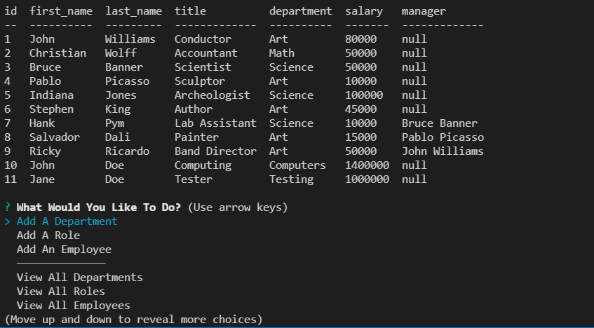

# <Week 12: Employee Tracker>  
  
    

  ## Description  
  ### What was your motivation?  
    - To test my knowledge of MYSQL database JOINS and integrating them into the terminal.  
  ### Why did you build this project?  
    - To integrate MYSQL with Inquirer prompts and Console.Table functionality to display information directly into the terminal.  
  ### What problem does it solve?  
    - As a business owner, I WANT to be able to view and manage the departments, roles, and employees in my company, SO THAT I can organize and plan my business.  
  ### What did you learn making this project?  
    - I learned about MYSQL Joins, Inner Joins, Foreign Keys, Inquirer integration, and Console.Table.  
   
  ## Table of Contents 
  - [Installation](#installation)  
  - [Usage](#usage)  
  - [Credits](#credits)  
  - [License](#license)  

  ## Installation  
  ### The application will be invoked by using the following command:  
      node index.js  

  ## Usage  
    
  Demo video linked at:[Video](https://drive.google.com/file/d/1QoRYADF2AYRwfnVh-QPRXHZ0p7eoYdPs/view "Demo Video")

      
  ## Credits  
  Contact me at: [email](poo328@my.utsa.edu "email")  
  Github can be found at: [Github](https://github.com/MrG105 "Github")  
    
  ## License
      Licensed under the MIT license  
  ---
